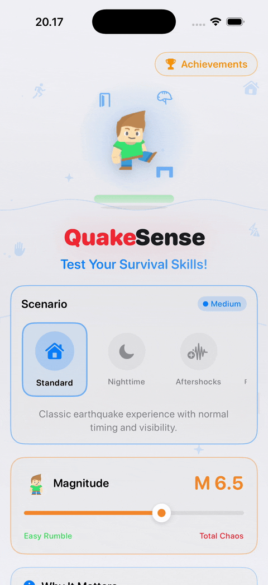
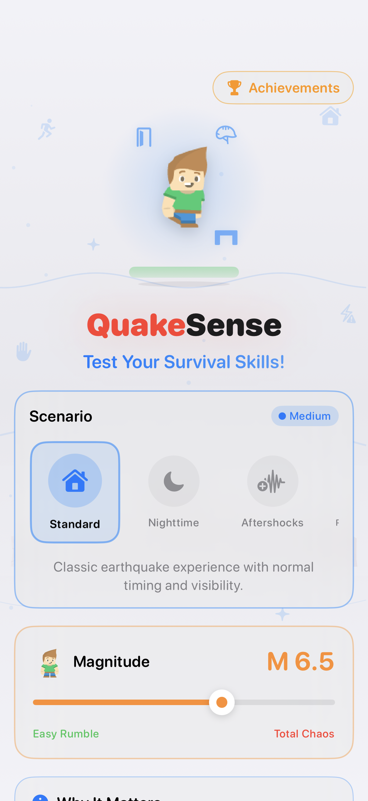
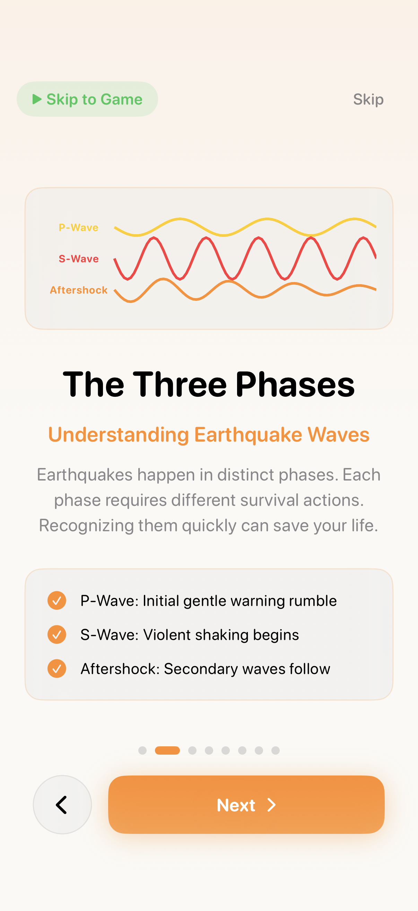
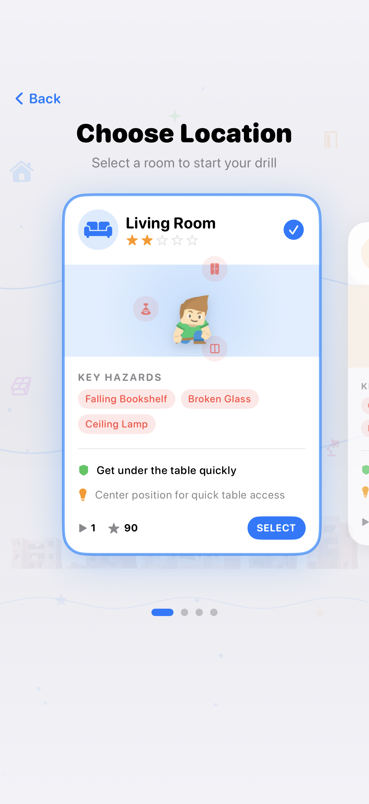
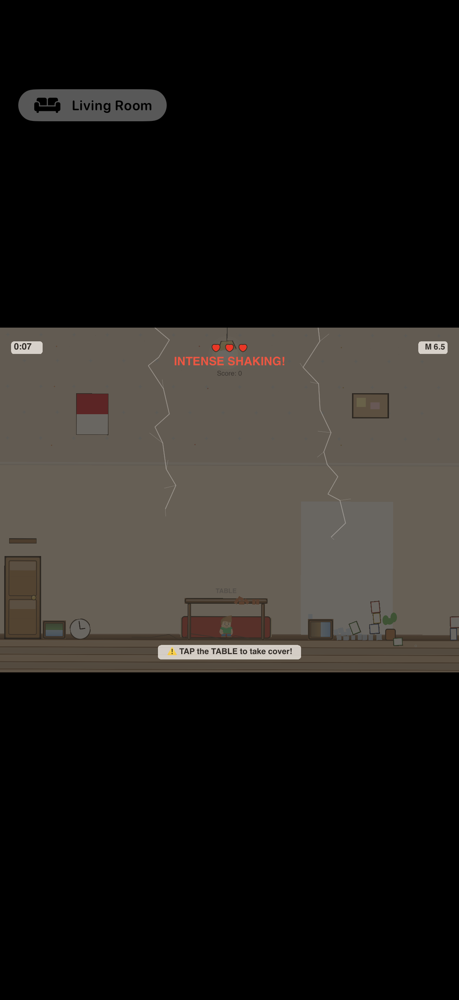
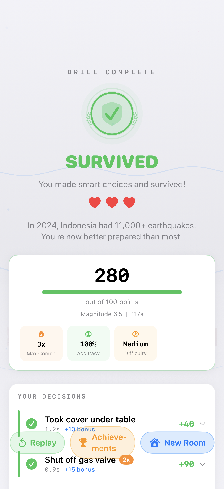
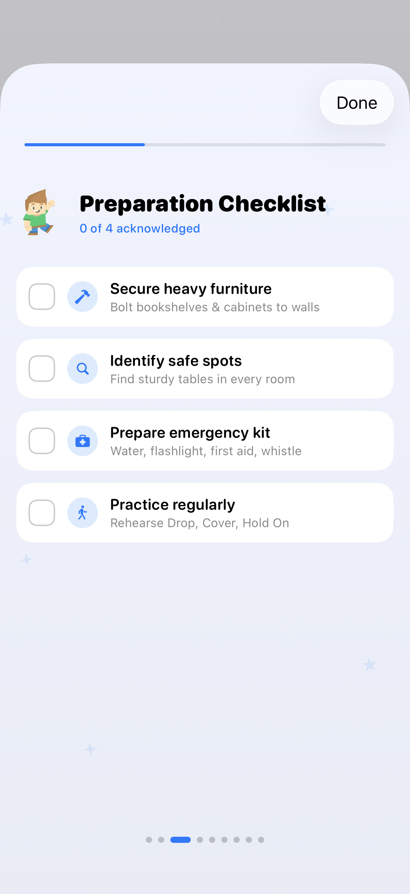
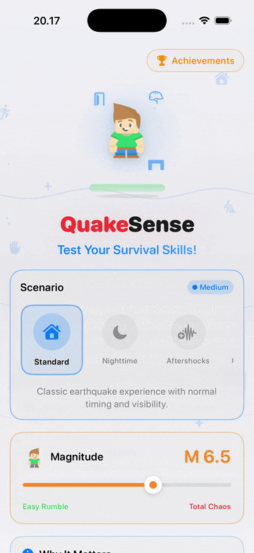
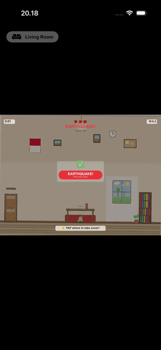
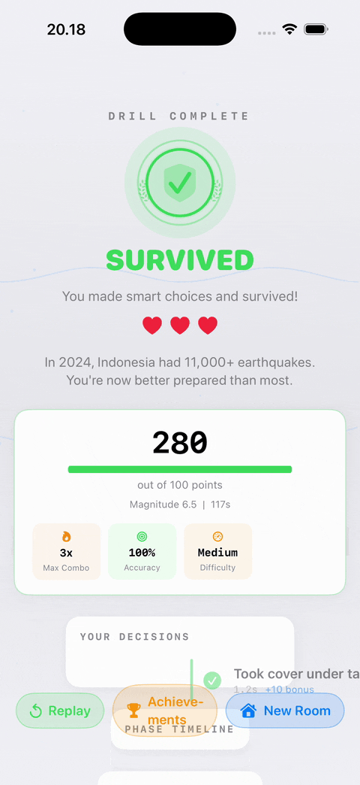

<div align="center">

<!-- Replace with real GIF after capture -->


# QuakeSense

**Earthquake survival training — without leaving the classroom.**

[](REPLACE_WITH_APPETIZE_URL)


</div>

---

## The problem

When I was twelve, sitting in a Jakarta classroom, the ground began to shake. None of us knew what to do. In those seconds of confusion, I learned that **knowledge without practice is useless when your hands are shaking.**

Indonesia experiences over 11,000 earthquakes annually, yet most students have never practiced a single drill. The gap between knowing and doing costs thousands of lives every year.

## What QuakeSense does

QuakeSense transforms earthquake survival training into a 2-minute interactive simulation. Instead of reading instructions, you *experience* a realistic earthquake in three escalating phases:

- **P-wave** — the early-warning rumble. Time to think.
- **S-wave** — violent shaking, falling debris, split-second decisions.
- **Aftershock** — the danger isn't over. Stay in position.

Every session builds muscle memory for the Drop–Cover–Hold-On response.

---

## Screens

<table>
<tr>
<td></td>
<td></td>
<td></td>
</tr>
<tr>
<td align="center"><sub>Train for the shake.</sub></td>
<td align="center"><sub>P-wave. S-wave. Aftershock.</sub></td>
<td align="center"><sub>Pick your nightmare.</sub></td>
</tr>
<tr>
<td></td>
<td></td>
<td></td>
</tr>
<tr>
<td align="center"><sub>Drop. Cover. Hold on.</sub></td>
<td align="center"><sub>You survived.</sub></td>
<td align="center"><sub>16 evidence-based tips.</sub></td>
</tr>
</table>

---

## In motion

<table>
<tr>
<td></td>
<td></td>
</tr>
<tr>
<td></td>
<td></td>
</tr>
</table>

---

## Demo video

[](REPLACE_WITH_YOUTUBE_URL)

<!-- Upload Portfolio/video/demo.mp4 to YouTube (unlisted) and paste the URL above -->

---

## Tech

| Framework | Use |
|-----------|-----|
| **SwiftUI** | All UI screens — onboarding, menus, debrief, settings |
| **SpriteKit** | Physics simulation — 50+ interacting bodies (shelves, glass, debris) |
| **CoreHaptics** | Scientifically-informed seismic haptic patterns synced to visual shake |
| **CoreMotion** | Accelerometer tilt control for moving the player character |
| **AVFoundation** | 7-channel procedural audio engine — no external audio files |
| **AppIntents** | Siri Shortcuts integration |

Zero external dependencies. Every texture, sound, and haptic pattern is generated procedurally.

### Accessibility

- VoiceOver with semantic labels + live announcements during gameplay
- Dynamic Type at every size
- Reduce Motion mode replaces screen shake with visual indicators
- Adjustable haptic intensity (10–100%)
- High contrast support

---

## Try it

**Play in browser (no install):** [Appetize.io embed](REPLACE_WITH_APPETIZE_URL)
*(Note: tilt control and haptics are not available in the browser — use a device for the full experience)*

**On your iPad/Mac:**
1. Clone or download this repo
2. Open `QuakeSense.swiftpm` in **Swift Playgrounds 4** on iPad or Mac
3. Tap Run

**Build in Xcode:**
```bash
open QuakeSense.swiftpm
# Select "iPhone 15 Pro" simulator, press Cmd+R
```

---

## Educational framework

Training content is grounded in guidelines from USGS, the Red Cross, and BMKG Indonesia. Sixteen evidence-based survival tips span Before / During / After phases, presented as interactive checklists that require active engagement.

The decision engine uses game-design principles — combo multipliers, time bonuses, consequence feedback — to convert safety information into procedural knowledge.

---

<div align="center">
<sub>Built by Willson · Swift Student Challenge 2026 · ipohunter26@gmail.com</sub>
</div>
